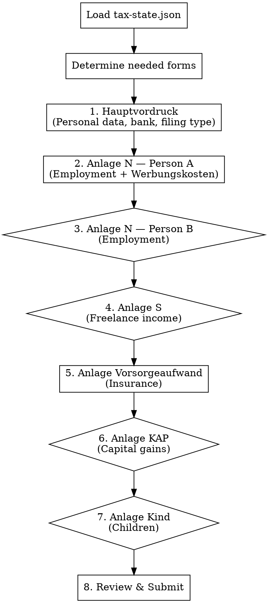

# ELSTER Filing Guide

## Overview

TaxFix-style guided assistant for filling a German Einkommensteuererklaerung in ELSTER. Translates complex ELSTER forms into plain-language steps. Never shows raw form names without explanation.

**Prerequisite:** `workspace/tax-state.json` must exist with at least intake data. If not, tell the user to run `/steuer intake` first.

**Authoritative Zeile numbers:** see `references/elster-zeilen-2024.md` (TY 2024) and `references/elster-zeilen-2025.md` (TY 2025 — restructured Mantelbogen; many values flagged [UNVERIFIED] pending ELSTER confirmation). The Zeile numbers in this SKILL.md were audited on 2026-04-17 and corrected; if they ever disagree with the reference file, the reference file wins. Always cite the year-specific file when coaching a user.

## How It Works

1. Load `workspace/tax-state.json` to know what data is available
2. Determine which ELSTER forms (Anlagen) are needed based on the user's situation
3. Walk through each form section-by-section using plain-language prompts
4. For each field: show the ELSTER location, the value to enter, and a brief explanation
5. User confirms they entered it, then move to next section
6. Track progress — user can pause and resume anytime

## Gate Pattern

Before each Anlage, ask a yes/no gate question. If the data exists in tax-state.json, pre-answer the gate:

```
"Based on your data, you have employment income — so we need the employment form (Anlage N). Ready to fill it in?"
```

If a section has no data in the state file, ask:

```
"Did you have [situation]? If not, we'll skip this form."
```

## Filing Session Flow



Diamond shapes = gate question (skip if not applicable). Box shapes = always needed.

## Interaction Style

- **One section at a time.** Don't dump 50 fields at once.
- **Group related fields** into batches of 3-5 fields max.
- **Show a mini-table** for each batch with: Field name (plain language) | ELSTER location | Value to enter
- **After each batch**, ask: "Have you entered these? Ready for the next section?"
- **Running progress**: After completing each Anlage, show a checklist of what's done and what's next.
- **If the user is stuck**: Explain where to find the field in ELSTER (menu path, section name).

## Form-by-Form Guide

### FORM 1: Hauptvordruck (Main Form — ESt 1 A)

This is the master form. Everyone needs it.

**Section 1.1: Personal Data (Allgemeine Angaben)**

Present for Person A, then Person B (if Zusammenveranlagung):

| What to enter | ELSTER field | Value |
|---|---|---|
| Tax ID (Identifikationsnummer) | Steuerpflichtige Person — Identifikationsnummer | From state: `persons[0].identifikationsnummer` |
| Date of birth | Geburtsdatum | From state: `persons[0].dob` |
| Religion | Religionszugehoerigkeit | "keine" if `church_member: false` |
| Address | Strasse, Hausnummer, PLZ, Ort | From state: `persons[0].address` |

Repeat for Person B (Ehegatte) if joint filing.

**Section 1.2: Filing Type**

| What to enter | ELSTER field | Value |
|---|---|---|
| Joint filing | Zusammenveranlagung (Checkbox) | Check if `filing_status === "Zusammenveranlagung"` |

**Section 1.3: Bank Details**

| What to enter | ELSTER field | Value |
|---|---|---|
| IBAN for refund/payment | Bankverbindung — IBAN | Ask user if not in state |

**Section 1.4: Household Services (Steuerermäßigungen §35a)**

Only if `deductions.haushaltsnahe` has data.

> **Authoritative Zeile numbers: see `references/elster-zeilen-2024.md` (§35a block on Hauptvordruck) and `references/elster-zeilen-2025.md` (§35a moved to a new dedicated *Anlage Haushaltsnahe Aufwendungen* for TY 2025).**
>
> For TY 2024: §35a is on the Hauptvordruck (specific Zeile numbers within the §35a-block — verify in ELSTER at filing time; previously cited Zeile 38/39 could not be confirmed against the 2024 form retrieved 2026-04-17).
>
> For TY 2025: §35a is on the new Anlage Haushaltsnahe Aufwendungen — Zeile numbers [UNVERIFIED] pending form-PDF text extraction.

| What to enter | ELSTER field | Value |
|---|---|---|
| Haushaltsnahe Dienstleistungen (labor costs) | §35a-block, cap 4,000 EUR (combined with Abs.1) | `haushaltsnahe.paragraph_35a.haushaltsnahe_dienstleistungen.subtotal` |
| Handwerkerleistungen (labor costs) | §35a-block, cap 1,200 EUR | `haushaltsnahe.paragraph_35a.handwerkerleistungen.subtotal` |

> Tell the user: "These are direct tax credits — 20% of what you enter gets subtracted from your tax bill. Keep the Nebenkostenabrechnung as proof."

---

### FORM 2: Anlage N — Person A (Employment Income)

Gate: "You have employment income from [employer]. Let's fill in your Anlage N."

**Section 2.1: Employer Data**

| What to enter | ELSTER field | Value |
|---|---|---|
| eTIN or Steuernummer of employer | Zeile 4 | From state: `employers[0].employer_steuernummer` |

**Section 2.2: Income (from Lohnsteuerbescheinigung)**

Tell user: "These numbers come directly from your Lohnsteuerbescheinigung. The Zeile numbers on the LStB do NOT match the Anlage N Zeile numbers — don't confuse them."

> **Authoritative Zeile numbers: see `references/elster-zeilen-2024.md` Anlage N table.** For TY 2024, Bruttoarbeitslohn is Zeile 6; Entschädigung/Fünftelregelung is in the Zeilen 17–20 block (NOT Zeile 11); Lohnsteuer/Soli/Kirchensteuer sit in the Zeile 6–9 range directly under Bruttoarbeitslohn — exact sub-Zeile [UNVERIFIED] so verify in ELSTER.

| What to enter | Anlage N Zeile (TY 2024) | LStB Zeile | Value |
|---|---|---|---|
| Gross salary | 6 | Zeile 3 | `employers[0].brutto` |
| Severance / compensation (Fünftelregelung) | 17–20 block | Zeile 10 | `employers[0].entschaedigung_z10` (if present) |
| Wage tax withheld | 6–9 block | Zeile 4 | `employers[0].lohnsteuer` |
| Solidaritätszuschlag | 6–9 block | Zeile 5 | `employers[0].soli` |
| Church tax (employee) | 6–9 block | Zeile 6 | `employers[0].kirchensteuer_an` |

> If `entschaedigung_z10` exists: "You have a compensation payment (Entschaedigung) of [amount]. This qualifies for the Fuenftelregelung (one-fifth rule) — enter it in the Entschädigung-block (Zeilen 17–20), not in the regular Bruttoarbeitslohn field. ELSTER will apply the reduced tax rate automatically."

**Section 2.3: Werbungskosten (Work-Related Expenses)**

Only present items that exist in state and are above 0.

> **Authoritative Zeile numbers: see `references/elster-zeilen-2024.md` Anlage N table.** Previously-cited Zeile 45 (Homeoffice) and Zeile 46 (Weitere Werbungskosten) were incorrect — correct ranges are 61–62 and 64–67 for TY 2024.

| What to enter | Anlage N Zeile (TY 2024) | Value |
|---|---|---|
| Commute (Entfernungspauschale) — Erste Tätigkeitsstätte | 30–55 block (sub-divided by transport mode) | Distance: `distance_km`, Days: `days` |
| Home office days (Tagespauschale) | 61–62 (two scenarios: exclusive vs. mixed day) | Days: `homeoffice_pauschale.days` |
| Work tools (Arbeitsmittel) | 57–59 | `arbeitsmittel.amount` |
| Berufsverband-Beiträge | 56 | `berufsverband.amount` |
| Fortbildungskosten | 63 | `fortbildung.amount` |
| Phone & Internet | 64–67 (Weitere Werbungskosten block) | `phone_internet.amount` |
| Bank fees | 64–67 | `bank_fees.amount` |
| Work-related legal insurance | 64–67 | `rechtsschutz_arbeitsrecht.amount` |

> For the Weitere-Werbungskosten block: "Multiple items go into the 'Weitere Werbungskosten' block (Zeilen 64–67 on TY 2024 Anlage N). In ELSTER, you can add line items — create separate entries for each so it's clear to the Finanzamt."

> For commute: "Enter the one-way distance in km and the number of working days you went to the office. ELSTER calculates the deduction automatically (0.30 EUR/km for first 20 km, 0.38 EUR/km beyond)."

> For home office: "Enter the number of home office days. ELSTER applies 6 EUR/day, capped at 1,260 EUR/year (210 days)."

---

### FORM 3: Anlage N — Person B (Spouse Employment Income)

Gate: Check if `persons[1]` exists and has employers. If yes:
"Your spouse [name] has employment income from [employer]. Let's fill in their Anlage N."

Same structure as Form 2, but using `persons[1]` data. Typically simpler (no freelance, fewer Werbungskosten).

If spouse has no Werbungskosten above the Pauschbetrag: "The standard deduction of 1,230 EUR (Arbeitnehmer-Pauschbetrag) will be applied automatically. No need to enter individual items unless they exceed this amount."

---

### FORM 4: Anlage S (Freelance Income)

Gate: Check `persons[0].freelance_income`. If null, skip.

"You have freelance income. Let's fill in Anlage S."

**Section 4.1: Freelance Activity**

> **Authoritative Zeile numbers: see `references/elster-zeilen-2024.md` Anlage S table.** For TY 2024 Anlage S is a one-line-per-activity summary form — the Gewinn goes in Zeile 4 (or 5 for a second activity), computed via **Anlage EÜR** (mandatory for all §4 Abs. 3 EStG profit determination — there is no simplified "revenue in Zeile 4, expenses in Zeile 5" workflow).

| What to enter | Anlage S Zeile (TY 2024) | Value |
|---|---|---|
| Type of activity / Berufsbezeichnung | Kopfzeile | `freelance_income.service` |
| Steuernummer (freelance) | Kopfzeile | `freelance_income.steuernummer` |
| Gewinn aus freiberuflicher Tätigkeit (from Anlage EÜR) | 4 | `freelance_income.profit` |
| Gewinn aus weiterer freiberuflicher Tätigkeit | 5 | (if applicable) |

> "Revenue and expenses are declared on **Anlage EÜR**, not Anlage S. Anlage S only takes the net Gewinn from Anlage EÜR Zeile 4. Anlage EÜR is mandatory for all §4 Abs. 3 EStG profit determination — there is no form-less simplified workflow."

> If Kleinunternehmerregelung: "You're using the small business exemption (Kleinunternehmerregelung §19 UStG), so no Umsatzsteuererklaerung is needed."

---

### FORM 5: Anlage Vorsorgeaufwand (Insurance & Pension)

This form is always needed. Most data is pre-filled from the Lohnsteuerbescheinigung via electronic transmission.

"Most insurance data is already transmitted electronically by your employer. Let's check what else needs to be entered manually."

**Section 5.1: Check Electronic Transmission**

> "Your employer transmits RV, KV, PV, and AV contributions automatically. You usually don't need to re-enter these. Verify they appear in ELSTER's pre-filled data (Vorausgefuellte Steuererklaerung / VaSt)."

**Section 5.2: Additional Insurance (Manual Entry)**

Only present items from `deductions.sonderausgaben`.

> **Authoritative Zeile numbers: see `references/elster-zeilen-2024.md` Anlage Vorsorgeaufwand table.**

| What to enter | Anlage Vorsorgeaufwand Zeile (TY 2024) | Value |
|---|---|---|
| Privathaftpflicht-, KFZ-Haftpflicht-, Tierhalter-Haftpflicht | 46 (Haufe §3.8 Block Zeilen 45–46) | `haftpflichtversicherung.amount` |
| Berufsunfähigkeits-/Erwerbsunfähigkeitsversicherung | 45–46 | `bu_versicherung.amount` |
| Unfall-, Risikolebens | 45–46 | `unfall_risikoleben.amount` |

> "Private liability insurance (Haftpflicht) is deductible as sonstige Vorsorgeaufwendungen — but **only if the 1,900 EUR / 2,800 EUR cap is not already exhausted by your Basiskranken- und Pflegepflichtversicherung** (which usually exhausts it for employees). If your KV/PV is already at the cap, additional Haftpflicht has no tax effect."

---

### FORM 6: Anlage KAP (Capital Income)

Gate: Check `other_income` for capital_gains. If `requires_anlage_kap: true`:

"You have capital income from foreign brokers that wasn't taxed in Germany. Filing Anlage KAP is mandatory (Pflichtveranlagung)."

**Section 6.1: German Broker (Trade Republic) — Pre-withheld Kapitalerträge**

> **Authoritative Zeile numbers: see `references/elster-zeilen-2024.md` Anlage KAP table.** Previously-cited Zeile 15 (ausländische Kapitalerträge) was wrong for TY 2024 — correct Zeile is **19**. Zeile 41 for "anrechenbare ausländische Steuern" is also imprecise — the creditable-foreign-tax block is Zeilen **40–42** with sub-lines [UNVERIFIED].

| What to enter | Anlage KAP Zeile (TY 2024) | Value |
|---|---|---|
| Kapitalerträge mit KESt-Abzug (inländisch, aus Jahressteuerbescheinigung) | 7 | `trade_republic.kapitalertraege` |
| Enthaltene Gewinne aus Aktienveräußerungen (mit KESt) | 8 | `trade_republic.aktien_gewinne` |
| Enthaltene Verluste Aktien (mit KESt) | 13 | `trade_republic.aktien_verluste` |
| Enthaltene Verluste sonstige (mit KESt) | 12 | `trade_republic.sonstige_verluste` |
| Sparer-Pauschbetrag bereits in Anspruch genommen | 16–17 | `trade_republic.sparer_pauschbetrag_used` |
| Einbehaltene Kapitalertragsteuer | 37 | `trade_republic.kapitalertragsteuer` |
| Einbehaltener Solidaritätszuschlag | 38 | `trade_republic.soli_on_kest` |
| Einbehaltene Kirchensteuer | 39 | `trade_republic.kirchensteuer_on_kest` |

> "Trade Republic already applied the Sparer-Pauschbetrag. These values come from your Jahressteuerbescheinigung. Filing Anlage KAP for TR is only required if you want Günstigerprüfung (Zeile 4) or Überprüfung des Steuereinbehalts (Zeile 5), or to declare foreign broker income."

**Section 6.2: Foreign Brokers (Trading 212, DEGIRO) — No German KESt withheld**

This is the complex part. Walk through carefully.

| What to enter | Anlage KAP Zeile (TY 2024) | Value | Notes |
|---|---|---|---|
| Foreign dividends + distributions (gross) | 19 (Ausländische Kapitalerträge) | Sum of all foreign dividends + distributions | Trading 212 + DEGIRO dividends. ETF distributions from ausländische Fonds go in **Anlage KAP-INV**, not Anlage KAP Zeile 19. |
| Foreign interest income | 19 | Interest from Trading 212 | |
| Enthaltene Gewinne Aktien (ohne KESt) | 20 | Sub-amount of Zeile 19 | |
| Enthaltene Verluste sonstige (ohne KESt) | 22 | | |
| Aktienverluste (ohne KESt) | 23 | Negative total from foreign-broker stock sales | Separate loss pot — only offsets future stock gains |
| Anrechenbare ausländische Steuern (Quellensteuer) | 40–42 block | Total foreign WHT | Exact sub-Zeile [UNVERIFIED] — block covers creditable vs. still-to-be-credited |

> "Important: Stock losses (Aktienveräußerungsverluste, Zeile 23 if ohne KESt / Zeile 13 if mit KESt) and other losses (Zeile 22 / Zeile 12) are tracked in SEPARATE loss pots. Enter them in the correct Zeile. Request Verlustfeststellung so the Finanzamt carries them forward."

**Section 6.3: Verlustfeststellung (Loss Carryforward)**

| What to enter | ELSTER field | Value |
|---|---|---|
| Request loss carryforward | Checkbox for Verlustfeststellung | Check this box |
| Stock losses to carry forward | | `aktienveraeusserungsverluste.total` |

> "By checking the Verlustfeststellung box, the Finanzamt will issue a separate notice (Verlustfeststellungsbescheid) carrying your stock losses into future years."

---

### FORM 7: Anlage Kind (Children)

Gate: Check `children` array. If non-empty:

"You have [count] child(ren). Let's fill in Anlage Kind."

One Anlage Kind per child.

> **Authoritative Zeile numbers: see `references/elster-zeilen-2024.md` Anlage Kind table.**

| What to enter | Anlage Kind Zeile (TY 2024) | Value |
|---|---|---|
| Child's IdNr (Steuer-Identifikationsnummer) | 4 | Ask user if not in state |
| Child's name, Vorname, Geburtsdatum, Wohnort | 4–8 block | From state (or ask user) |
| Familienkasse (Kindergeld payer) | within child-ID block | |
| Kindergeld received (annual) | Kindergeld-Block | `kindergeld_annual` |
| Kinderbetreuungskosten | 66 | `kinderbetreuungskosten.deductible` (2/3, cap 4,000 EUR/Kind/yr) |

> "The Finanzamt runs the Guenstigerpruefung automatically — they'll check whether the Kinderfreibetrag or Kindergeld is better for you. You don't need to choose."

---

### FORM 8: Review & Submit

After all forms are complete:

1. **Show completion checklist:**
   ```
   [x] Hauptvordruck (Personal data, bank, §35a)
   [x] Anlage N — Person A (Employment + Werbungskosten)
   [x] Anlage N — Person B (Employment)
   [x] Anlage S (Freelance income)
   [x] Anlage Vorsorgeaufwand (Insurance)
   [x] Anlage KAP (Capital income + loss carryforward)
   [x] Anlage Kind (Child)
   ```

2. **Show estimated result:**
   "Based on your data, the estimated Nachzahlung is [amount] EUR."

3. **Pre-submission checklist:**
   - Have you entered your IBAN for payment/refund?
   - Have you checked ELSTER's Plausibilitaetspruefung (validation check)?
   - Do you want to preview the tax calculation in ELSTER before submitting?

4. **Submission:**
   "Click 'Erklaerung absenden' (Submit declaration) in ELSTER. You'll receive a confirmation (Uebermittlungsprotokoll). Save or print it — it's your proof of filing."

5. **After submission reminders:**
   - Keep all documents for at least 4 years (Belegvorhaltepflicht)
   - The Steuerbescheid (tax assessment) usually arrives in 4-12 weeks
   - You have 1 month to object (Einspruch) if you disagree with the assessment
   - If you owe money, payment is due 1 month after the Bescheid date

## State Tracking

Save filing progress to `workspace/tax-state.json` under a new key:

```json
{
  "filing": {
    "status": "in_progress",
    "forms_completed": ["hauptvordruck", "anlage_n_person_a"],
    "forms_remaining": ["anlage_n_person_b", "anlage_s", ...],
    "last_form": "anlage_n_person_a",
    "notes": []
  }
}
```

Update after each form is confirmed complete. This allows the user to pause and resume.

## Resuming a Session

If `filing.status === "in_progress"` when the skill loads:

"Welcome back! You've already completed: [list]. Let's continue with [next form]."

## Common ELSTER Navigation Tips

- **Adding an Anlage**: In the left sidebar, click "Formulare hinzufuegen" (Add forms)
- **Pre-filled data (VaSt)**: Click "Daten abholen" to load employer-transmitted data
- **Validation**: Click "Pruefung" before submitting to catch errors
- **Multiple employers**: Add a separate Anlage N for each employer
- **Spouse data**: In Zusammenveranlagung, ELSTER shows "Steuerpflichtige Person" (Person A) and "Ehefrau/Ehemann" (Person B) side by side in many forms
