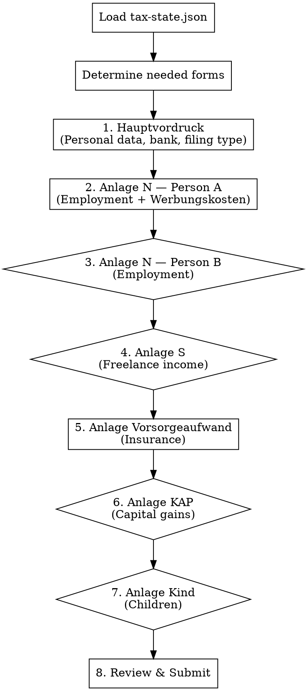

# ELSTER Filing Guide

## Overview

TaxFix-style guided assistant for filling a German Einkommensteuererklaerung in ELSTER. Translates complex ELSTER forms into plain-language steps. Never shows raw form names without explanation.

**Prerequisite:** `workspace/tax-state.json` must exist with at least intake data. If not, tell the user to run `/steuer intake` first.

## How It Works

1. Load `workspace/tax-state.json` to know what data is available
2. Determine which ELSTER forms (Anlagen) are needed based on the user's situation
3. Walk through each form section-by-section using plain-language prompts
4. For each field: show the ELSTER location, the value to enter, and a brief explanation
5. User confirms they entered it, then move to next section
6. Track progress — user can pause and resume anytime

## Gate Pattern

Before each Anlage, ask a yes/no gate question. If the data exists in tax-state.json, pre-answer the gate:

```
"Based on your data, you have employment income — so we need the employment form (Anlage N). Ready to fill it in?"
```

If a section has no data in the state file, ask:

```
"Did you have [situation]? If not, we'll skip this form."
```

## Filing Session Flow



Diamond shapes = gate question (skip if not applicable). Box shapes = always needed.

## Interaction Style

- **One section at a time.** Don't dump 50 fields at once.
- **Group related fields** into batches of 3-5 fields max.
- **Show a mini-table** for each batch with: Field name (plain language) | ELSTER location | Value to enter
- **After each batch**, ask: "Have you entered these? Ready for the next section?"
- **Running progress**: After completing each Anlage, show a checklist of what's done and what's next.
- **If the user is stuck**: Explain where to find the field in ELSTER (menu path, section name).

## Form-by-Form Guide

### FORM 1: Hauptvordruck (Main Form — ESt 1 A)

This is the master form. Everyone needs it.

**Section 1.1: Personal Data (Allgemeine Angaben)**

Present for Person A, then Person B (if Zusammenveranlagung):

| What to enter | ELSTER field | Value |
|---|---|---|
| Tax ID (Identifikationsnummer) | Steuerpflichtige Person — Identifikationsnummer | From state: `persons[0].identifikationsnummer` |
| Date of birth | Geburtsdatum | From state: `persons[0].dob` |
| Religion | Religionszugehoerigkeit | "keine" if `church_member: false` |
| Address | Strasse, Hausnummer, PLZ, Ort | From state: `persons[0].address` |

Repeat for Person B (Ehegatte) if joint filing.

**Section 1.2: Filing Type**

| What to enter | ELSTER field | Value |
|---|---|---|
| Joint filing | Zusammenveranlagung (Checkbox) | Check if `filing_status === "Zusammenveranlagung"` |

**Section 1.3: Bank Details**

| What to enter | ELSTER field | Value |
|---|---|---|
| IBAN for refund/payment | Bankverbindung — IBAN | Ask user if not in state |

**Section 1.4: Household Services (Steuerermäßigungen §35a)**

Only if `deductions.haushaltsnahe` has data:

| What to enter | ELSTER field | Value |
|---|---|---|
| Haushaltsnahe Dienstleistungen (labor costs) | Zeile 38 | `haushaltsnahe.paragraph_35a.haushaltsnahe_dienstleistungen.subtotal` |
| Handwerkerleistungen (labor costs) | Zeile 39 | `haushaltsnahe.paragraph_35a.handwerkerleistungen.subtotal` |

> Tell the user: "These are direct tax credits — 20% of what you enter gets subtracted from your tax bill. Keep the Nebenkostenabrechnung as proof."

---

### FORM 2: Anlage N — Person A (Employment Income)

Gate: "You have employment income from [employer]. Let's fill in your Anlage N."

**Section 2.1: Employer Data**

| What to enter | ELSTER field | Value |
|---|---|---|
| eTIN or Steuernummer of employer | Zeile 4 | From state: `employers[0].employer_steuernummer` |

**Section 2.2: Income (from Lohnsteuerbescheinigung)**

Tell user: "These numbers come directly from your Lohnsteuerbescheinigung. The Zeile numbers on the LStB match up."

| What to enter | ELSTER field | LStB Zeile | Value |
|---|---|---|---|
| Gross salary | Bruttoarbeitslohn, Zeile 6 | Zeile 3 | `employers[0].brutto` |
| Severance / compensation | Ermaessigt besteuerte Entschaedigung, Zeile 11 | Zeile 10 | `employers[0].entschaedigung_z10` (if present) |
| Wage tax withheld | Einbehaltene Lohnsteuer, Zeile 12 | Zeile 4 | `employers[0].lohnsteuer` |
| Solidaritaetszuschlag | Zeile 13 | Zeile 5 | `employers[0].soli` |
| Church tax (employee) | Zeile 14 | Zeile 6 | `employers[0].kirchensteuer_an` |

> If `entschaedigung_z10` exists: "You have a compensation payment (Entschaedigung) of [amount]. This qualifies for the Fuenftelregelung (one-fifth rule) — enter it in Zeile 11, not in the regular salary field. ELSTER will apply the reduced tax rate automatically."

**Section 2.3: Werbungskosten (Work-Related Expenses)**

Only present items that exist in state and are above 0:

| What to enter | ELSTER field | Value |
|---|---|---|
| Commute (Entfernungspauschale) | Wege zwischen Wohnung und erster Taetigkeitsstaette, Zeilen 31-39 | Distance: `distance_km`, Days: `days` |
| Home office days | Homeoffice-Pauschale, Zeile 45 | Days: `homeoffice_pauschale.days` |
| Phone & Internet | Weitere Werbungskosten, Zeile 46 | `phone_internet.amount` |
| Bank fees | Weitere Werbungskosten, Zeile 46 | `bank_fees.amount` |
| Work-related legal insurance | Weitere Werbungskosten, Zeile 46 | `rechtsschutz_arbeitsrecht.amount` |

> For Zeile 46 items: "Multiple items go into 'Weitere Werbungskosten' (Zeile 46). In ELSTER, you can add line items — create separate entries for each so it's clear to the Finanzamt."

> For commute: "Enter the one-way distance in km and the number of working days you went to the office. ELSTER calculates the deduction automatically (0.30 EUR/km for first 20 km, 0.38 EUR/km beyond)."

> For home office: "Enter the number of home office days. ELSTER applies 6 EUR/day, capped at 1,260 EUR/year (210 days)."

---

### FORM 3: Anlage N — Person B (Spouse Employment Income)

Gate: Check if `persons[1]` exists and has employers. If yes:
"Your spouse [name] has employment income from [employer]. Let's fill in their Anlage N."

Same structure as Form 2, but using `persons[1]` data. Typically simpler (no freelance, fewer Werbungskosten).

If spouse has no Werbungskosten above the Pauschbetrag: "The standard deduction of 1,230 EUR (Arbeitnehmer-Pauschbetrag) will be applied automatically. No need to enter individual items unless they exceed this amount."

---

### FORM 4: Anlage S (Freelance Income)

Gate: Check `persons[0].freelance_income`. If null, skip.

"You have freelance income. Let's fill in Anlage S."

**Section 4.1: Freelance Activity**

| What to enter | ELSTER field | Value |
|---|---|---|
| Type of activity | Art der Taetigkeit | `freelance_income.service` |
| Steuernummer (freelance) | Steuernummer | `freelance_income.steuernummer` |
| Revenue (Betriebseinnahmen) | Zeile 4 or via Anlage EÜR | `freelance_income.revenue` |
| Expenses (Betriebsausgaben) | Zeile 5 or via Anlage EÜR | `freelance_income.expenses` |
| Profit | Gewinn | `freelance_income.profit` |

> "If your revenue is below 22,000 EUR and your profit below 60,000 EUR, you can use the simplified profit calculation directly in Anlage S without a separate Anlage EUER. Enter revenue in Zeile 4 and expenses in Zeile 5."

> If Kleinunternehmerregelung: "You're using the small business exemption (Kleinunternehmerregelung §19 UStG), so no Umsatzsteuererklaerung is needed."

---

### FORM 5: Anlage Vorsorgeaufwand (Insurance & Pension)

This form is always needed. Most data is pre-filled from the Lohnsteuerbescheinigung via electronic transmission.

"Most insurance data is already transmitted electronically by your employer. Let's check what else needs to be entered manually."

**Section 5.1: Check Electronic Transmission**

> "Your employer transmits RV, KV, PV, and AV contributions automatically. You usually don't need to re-enter these. Verify they appear in ELSTER's pre-filled data (Vorausgefuellte Steuererklaerung / VaSt)."

**Section 5.2: Additional Insurance (Manual Entry)**

Only present items from `deductions.sonderausgaben`:

| What to enter | ELSTER field | Value |
|---|---|---|
| Haftpflichtversicherung (liability) | Zeile 46-48 (Weitere sonstige Vorsorgeaufwendungen) | `haftpflichtversicherung.amount` |

> "Private liability insurance (Haftpflicht) is deductible as sonstige Vorsorgeaufwendungen. Enter the annual premium."

---

### FORM 6: Anlage KAP (Capital Income)

Gate: Check `other_income` for capital_gains. If `requires_anlage_kap: true`:

"You have capital income from foreign brokers that wasn't taxed in Germany. Filing Anlage KAP is mandatory (Pflichtveranlagung)."

**Section 6.1: German Broker (Trade Republic)**

| What to enter | ELSTER field | Value |
|---|---|---|
| Kapitalertraege (domestic) | Zeile 7 | `trade_republic.kapitalertraege` |
| Sparer-Pauschbetrag already used | Zeile 17 | `trade_republic.sparer_pauschbetrag_used` |
| KESt withheld | Zeile 37 | `trade_republic.kapitalertragsteuer` |

> "Trade Republic already applied the Sparer-Pauschbetrag. These values come from your Jahressteuerbescheinigung."

**Section 6.2: Foreign Brokers (Trading 212, DEGIRO)**

This is the complex part. Walk through carefully:

| What to enter | ELSTER field | Value | Notes |
|---|---|---|---|
| Foreign dividends (gross) | Zeile 15 (Auslaendische Kapitalertraege) | Sum of all foreign dividends + distributions | Trading212 dividends + ETF distributions + DEGIRO dividends |
| Foreign interest income | Zeile 15 (include with above) | Interest from Trading212 | |
| Foreign WHT paid | Zeile 41 (Anrechenbare auslaendische Steuern) | Total foreign WHT | May not be creditable if no German tax due |
| Stock sale losses (Aktienverauesserungsverluste) | Zeile 13 (Verluste aus Aktienveräußerungen) | Negative total from stock sales | Separate loss pot — only offsets future stock gains |
| ETF/other sale losses | Zeile 14 (Verluste sonstige) | ETF sale losses | Can offset other capital income |

> "Important: Stock losses (Aktienverauesserungsverluste) and other losses are tracked in SEPARATE loss pots. Enter them in separate fields. Request Verlustfeststellung so the Finanzamt carries them forward."

**Section 6.3: Verlustfeststellung (Loss Carryforward)**

| What to enter | ELSTER field | Value |
|---|---|---|
| Request loss carryforward | Checkbox for Verlustfeststellung | Check this box |
| Stock losses to carry forward | | `aktienveraeusserungsverluste.total` |

> "By checking the Verlustfeststellung box, the Finanzamt will issue a separate notice (Verlustfeststellungsbescheid) carrying your stock losses into future years."

---

### FORM 7: Anlage Kind (Children)

Gate: Check `children` array. If non-empty:

"You have [count] child(ren). Let's fill in Anlage Kind."

One Anlage Kind per child:

| What to enter | ELSTER field | Value |
|---|---|---|
| Child's name | Vorname, Name | From state (or ask user) |
| Date of birth | Geburtsdatum | From state |
| Child's tax ID | Identifikationsnummer des Kindes | Ask user if not in state |
| Kindergeld received | Hoehe des Kindergeldes | `kindergeld_annual` |
| Who received Kindergeld | Empfaenger | `kindergeld_recipient` |
| Childcare costs | Kinderbetreuungskosten | `kinderbetreuungskosten.deductible` |

> "The Finanzamt runs the Guenstigerpruefung automatically — they'll check whether the Kinderfreibetrag or Kindergeld is better for you. You don't need to choose."

---

### FORM 8: Review & Submit

After all forms are complete:

1. **Show completion checklist:**
   ```
   [x] Hauptvordruck (Personal data, bank, §35a)
   [x] Anlage N — Person A (Employment + Werbungskosten)
   [x] Anlage N — Person B (Employment)
   [x] Anlage S (Freelance income)
   [x] Anlage Vorsorgeaufwand (Insurance)
   [x] Anlage KAP (Capital income + loss carryforward)
   [x] Anlage Kind (Child)
   ```

2. **Show estimated result:**
   "Based on your data, the estimated Nachzahlung is [amount] EUR."

3. **Pre-submission checklist:**
   - Have you entered your IBAN for payment/refund?
   - Have you checked ELSTER's Plausibilitaetspruefung (validation check)?
   - Do you want to preview the tax calculation in ELSTER before submitting?

4. **Submission:**
   "Click 'Erklaerung absenden' (Submit declaration) in ELSTER. You'll receive a confirmation (Uebermittlungsprotokoll). Save or print it — it's your proof of filing."

5. **After submission reminders:**
   - Keep all documents for at least 4 years (Belegvorhaltepflicht)
   - The Steuerbescheid (tax assessment) usually arrives in 4-12 weeks
   - You have 1 month to object (Einspruch) if you disagree with the assessment
   - If you owe money, payment is due 1 month after the Bescheid date

## State Tracking

Save filing progress to `workspace/tax-state.json` under a new key:

```json
{
  "filing": {
    "status": "in_progress",
    "forms_completed": ["hauptvordruck", "anlage_n_person_a"],
    "forms_remaining": ["anlage_n_person_b", "anlage_s", ...],
    "last_form": "anlage_n_person_a",
    "notes": []
  }
}
```

Update after each form is confirmed complete. This allows the user to pause and resume.

## Resuming a Session

If `filing.status === "in_progress"` when the skill loads:

"Welcome back! You've already completed: [list]. Let's continue with [next form]."

## Common ELSTER Navigation Tips

- **Adding an Anlage**: In the left sidebar, click "Formulare hinzufuegen" (Add forms)
- **Pre-filled data (VaSt)**: Click "Daten abholen" to load employer-transmitted data
- **Validation**: Click "Pruefung" before submitting to catch errors
- **Multiple employers**: Add a separate Anlage N for each employer
- **Spouse data**: In Zusammenveranlagung, ELSTER shows "Steuerpflichtige Person" (Person A) and "Ehefrau/Ehemann" (Person B) side by side in many forms
